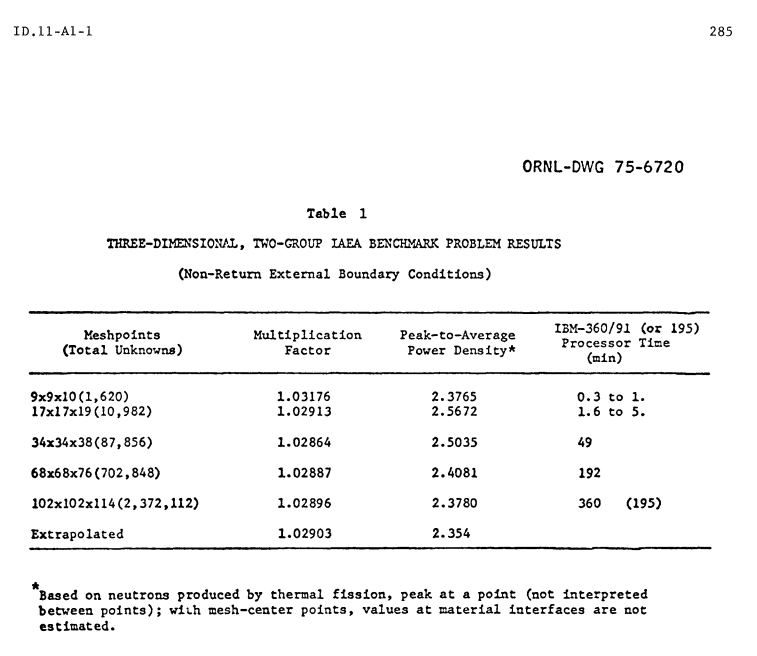

# NERS561_3DMDS
NERS561 core design final project: implementataion of a 3D Multigroup Nodal Diffusion Solver

# OVERVIEW:
3D Multigroup Nodal Diffusion Solver  -- {simulate3}
- Implement 4th-Order NEM (multigroup)
    - Two-node kernel 
    - 2nd order transverse leakage
- Regular Cartesian grid with jagged boundaries
- Reflective and vacuum boundary conditions
- Coarse Mesh Finite Difference Acceleration
- Use specified multigroup macroscopic cross sections
- Extra-credit
    - Also implement the source expansion nodal method (SENM)
    - Implement Wielandt-Shifted Power Iteration
    - Implement parallelism on the nodal sweep

# HW 4
Nodal Diffusion Team. 
Begin writing your program, and decide how you want to specify the input. The input should include
- The name (or names) of a cross section library file with macroscopic multigroup cross sections
- A cartesian geometry description of the problem, this includes
    - material boundaries defined as lines that are parallel to the x-axis, y-axis, or z-axis
    - material IDs for each volume
- Mesh parameters to subdivide each material region into a smaller cartesian mesh
- Boundary conditions: reflective or vacuum
Then your initial program should
- setup the problem mesh as a data structure of your own design
- setup a coefficient matrix for 3D fine-mesh finite difference. Again, the choice of data structure for the matrix is left up to you

# HW 5
From your existing code, extend the capability to
- include a 1-node NEM kernel
- solve the 3D fine mesh finite difference equations
- Process (and use) few-group cross section data

For these capabilities think about how to verify their correctness and produce that evidence.
- To verify yours solver, I suggest doing some legacy diffusion benchmarks. (NEARCP, IAEA, or the
Argonne Benchmark Handbook)

Expeted results (I think?):
- The ANL Benchmark Handbook, problem 11 or problem 3: https://www.osti.gov/servlets/purl/12030251

